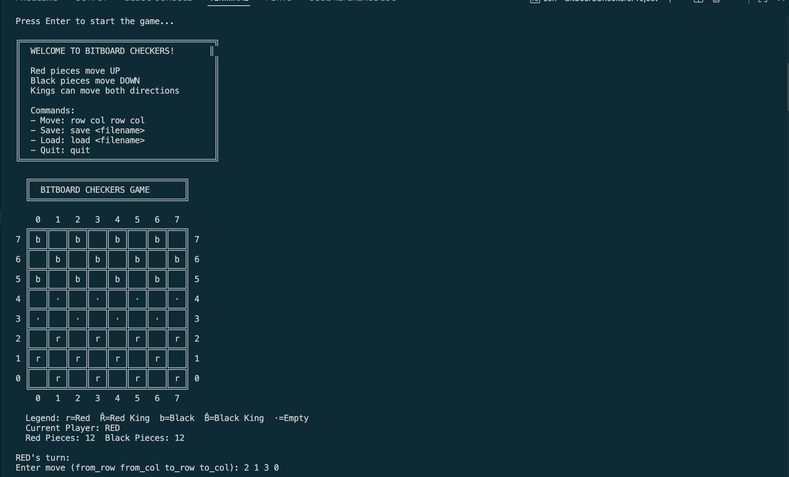
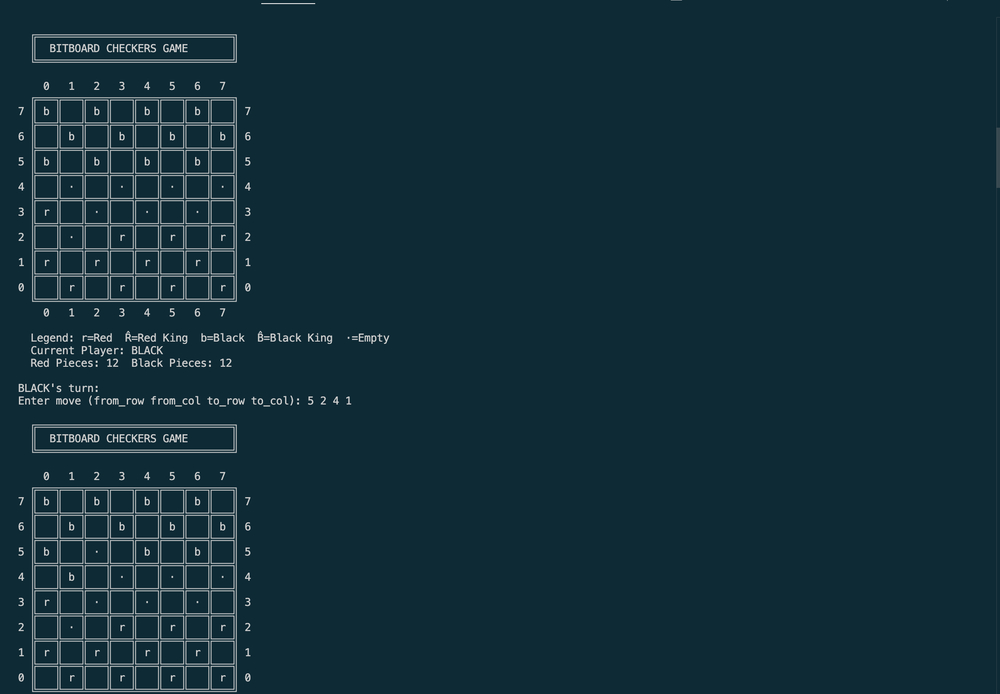
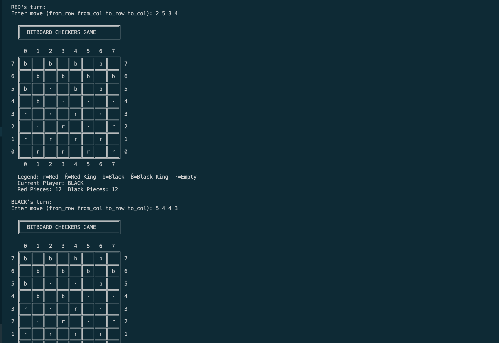

# Bitboard Checkers Project

# Description

A complete implementation of checkers using bitboard data structures and bit manipulation techniques.

## 📁 Project Structure

```
Bitboard_Checkers/
│
├── bitops.h          # Header for bit manipulation functions
├── bitops.c          # Implementation of basic bit operations
├── board.h           # Header for board representation functions
├── board.c           # Board setup and printing functions
├── game.h            # Header for game logic
├── game.c            # Move, capture, promotion, win-check logic
├── main.c            # Game loop and player input
├── Makefile          # Build automation
└── README.md         # This file
```

## 🚀 Quick Start

### Option 1: Using Makefile (Recommended)

```bash
# Build the game
make

# Run the game
./checkers

# Or build and run in one command
make run

# Clean up compiled files
make clean
```

### Option 2: Manual Compilation

```bash
# Compile all files and link
gcc -Wall -g -o checkers bitops.c board.c game.c main.c

# Run the game
./checkers
```

### Option 3: Compile Separately

```bash
# Compile each file
gcc -Wall -g -c bitops.c
gcc -Wall -g -c board.c
gcc -Wall -g -c game.c
gcc -Wall -g -c main.c

# Link all object files
gcc -Wall -g -o checkers bitops.o board.o game.o main.o

# Run the game
./checkers
```

## 🎮 How to Play

### Game Rules
- **Red pieces** start at the bottom and move UP (increasing row numbers)
- **Black pieces** start at the top and move DOWN (decreasing row numbers)
- **Regular pieces** can only move forward diagonally
- **Kings** (crowned pieces) can move both forward and backward
- **Captures** are made by jumping over an opponent's piece
- **Win** by capturing all opponent pieces

### Input Format
Enter moves as: `from_row from_col to_row to_col`

**Examples:**
```
2 1 3 2    # Move piece from (2,1) to (3,2)
5 4 3 2    # Capture move jumping 2 squares
```

### Special Commands
- Type `quit` to exit the game
- Type `save` followed by `<filename>.sav` to save a file with the current game state
- Type `load` followed by `<filename>.sav` to load the game state you saved in the file
- 

## 🎯 Key Features

### Bitboard Implementation
- Uses `unsigned long long` (64 bits) for 8×8 board
- Separate bitboards for red/black pieces and kings
- Efficient bit manipulation for all operations


### Visual Display
```
  ╔═══════════════════════════════╗
  ║  BITBOARD CHECKERS GAME       ║
  ╚═══════════════════════════════╝

    0   1   2   3   4   5   6   7
  ╔═══╦═══╦═══╦═══╦═══╦═══╦═══╦═══╗
7 ║   ║ b ║   ║ b ║   ║ b ║   ║ b ║ 7
  ╠═══╬═══╬═══╬═══╬═══╬═══╬═══╬═══╣
6 ║ b ║   ║ b ║   ║ b ║   ║ b ║   ║ 6
  ╠═══╬═══╬═══╬═══╬═══╬═══╬═══╬═══╣
5 ║   ║ b ║   ║ b ║   ║ b ║   ║ b ║ 5
  ╠═══╬═══╬═══╬═══╬═══╬═══╬═══╬═══╣
4 ║ · ║   ║ · ║   ║ · ║   ║ · ║   ║ 4
  ╠═══╬═══╬═══╬═══╬═══╬═══╬═══╬═══╣
3 ║   ║ · ║   ║ · ║   ║ · ║   ║ · ║ 3
  ╠═══╬═══╬═══╬═══╬═══╬═══╬═══╬═══╣
2 ║ r ║   ║ r ║   ║ r ║   ║ r ║   ║ 2
  ╠═══╬═══╬═══╬═══╬═══╬═══╬═══╬═══╣
1 ║   ║ r ║   ║ r ║   ║ r ║   ║ r ║ 1
  ╠═══╬═══╬═══╬═══╬═══╬═══╬═══╬═══╣
0 ║ r ║   ║ r ║   ║ r ║   ║ r ║   ║ 0
  ╚═══╩═══╩═══╩═══╩═══╩═══╩═══╩═══╝
    0   1   2   3   4   5   6   7

  Legend: r=Red  R̂=Red King  b=Black  B̂=Black King  ·=Empty
  Current Player: Red
  Red Pieces: 12   Black Pieces: 12
```
## Demo






## 🛠️ Technical Details

### Data Types Used
- `unsigned long long` (64 bits) for the game board
- Each bit represents one square on the 8×8 board
- Bit 0 = position (0,0), Bit 63 = position (7,7)

### Bitwise Operations Used
- `|` (OR) - Setting bits
- `&` (AND) - Checking bits
- `~` (NOT) - Clearing bits
- `^` (XOR) - Toggling bits
- `<<` `>>` - Shifting bits

### File Dependencies
```
main.c
  ├── bitops.h
  ├── board.h
  │   └── bitops.h
  └── game.h
      ├── board.h
      └── bitops.h
```

## 📝 Notes

- Only dark squares (where row + col is odd) are playable
- King promotion happens automatically when reaching the far edge
- The game displays piece counts and current player
- All game logic uses bitwise operations


## 💡 Tips for Understanding

1. Start by reading `bitops.c` to understand basic bit operations
2. Look at `board.c` to see how the board is represented
3. Study `game.c` to understand move validation
4. Play the game to see everything working together!
